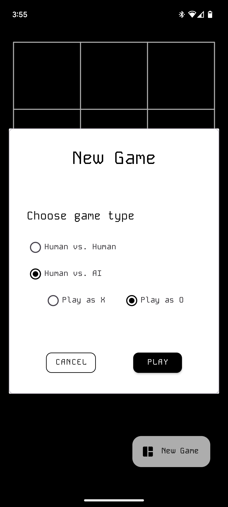
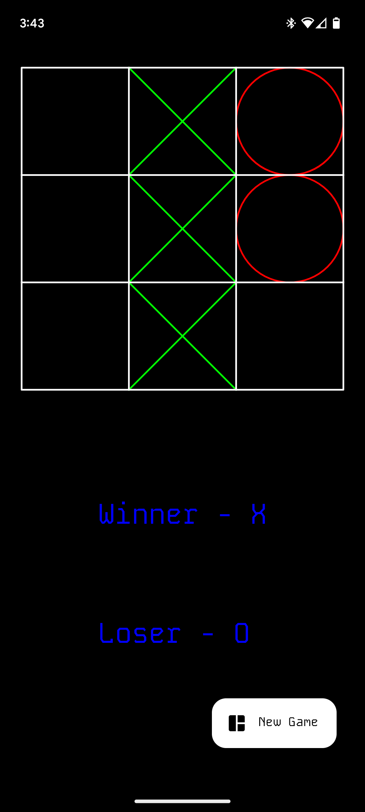
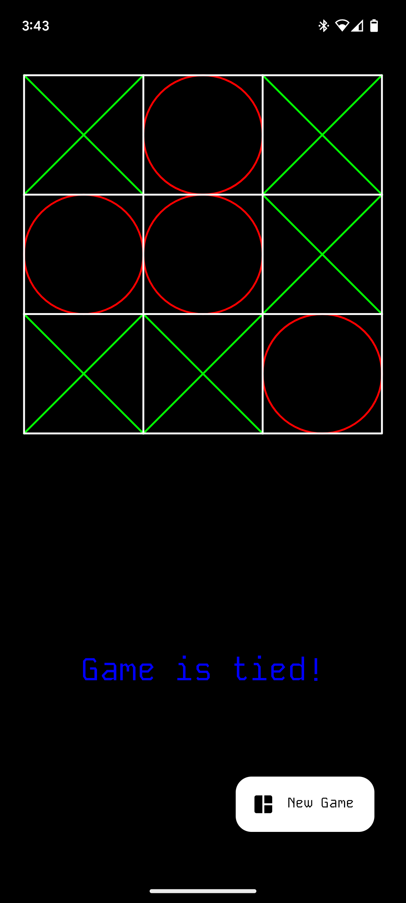
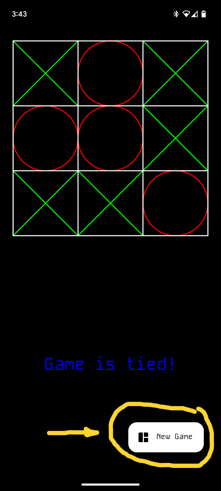

Grade: 50/50

# Program 5 - Tic Tac Toe with AI Player (Minimax Algorithm)

## COSC 5730

## Almountassir Bellah Aljazwe

## Description

- Physical Device Used :

  - Google Pixel 7
  - Android Version : 13/14
  - Dimensions :
    - 6.13 x 2.88 x 0.34 inches
    - 155.6 x 73.2 x 8.7 mm

- Compatible Program Android Versions :

  - Android 10 - 14
  - Minimum SDK version = 29
  - Target SDK version = 34

## How to Use App

- The app starts in the main game screen.
- The default game type is human against human, so begin playing with another person by clicking on game board spots, while alternating players in between.
- If you want to play against an AI, press the "New Game" button in the bottom left of the app and select "Human vs AI"; you can also choose what game shape you want to play as; keep in mind that "X" will always go first, so if you choose "O", the AI will play first.
- At the end of the game, the result will be communicated to you in the bottom half section of the game screen.
- To play again, press the "New Game" button located in the bottom right of the game and select the options for the new game.

## Problems

Hopefully none.

## Requirements Check-list

- [x] Drawing methods must be used to create the Tic-Tac-Toe board and its functionality.

  - Locate the "BoardCanvas.kt" file which is a class that implements the "View" class; this allows the "BoardCanvas" class to implement functions such as "onSizeChanged" and "onDraw", in addition to using the "android.graphics" library to implement a canvas, shapes, color, and touch detection to draw and interact with the game board on the view.

- [x] Player "X" always goes first.

  - On line 101 of the "BoardCanvas.kt" file, the following line is declared to enforce Player "X" always going first when initially started...

    ```kotlin
    private var currentPlayer = Player.X
    ```

  - Additionally, on line 118 in the "resetGame" function of the "BoardCanvas.kt" file, the following line is declared to enforce Player "X" always going first when a game is reset to its beginning...

    ```kotlin
    currentPlayer = Player.X
    ```

- [x] Program game must be able to be played by two alternating players that take turns passing the phone back and forth. (COSC 5730) Program must also have an option for the other player to be an AI player; the user will also determine if they want to be "X" or "O".

  

- [x] The AI must be “smarter” than just picking a random location and it should play to win.

  - Locate the "ai_functions/get_smart_move.kt" file which is used by the AI to make a smart move; this function calls the function, in the "ai_functions/minimax.kt" file, to select the best move, given a particular board configuration; the "ai_functions/minimax.kt" file implements the "Minimax" algorithm.

  - **NOTE**... when AI plays first, it plays randomly as it is just the first move and there should be no need for it to use a complex algorithm to play the first move; for any other move, however, it plays smartly.

- [x] Your code will need to determine the winner, loser, and tie.

  - After each turn is played, the following lines of code are placed to check for a win or a tie. If a win is detected, a winner and a loser are determined; if the board is full, then a tie is detected...

    ```kotlin
    if (checkWin(board, currentPlayer.number)) {
        appViewModel.setWinner(currentPlayer.playerName)

        when (currentPlayer) {
            Player.X -> appViewModel.setLoser(Player.O.playerName)
            Player.O -> appViewModel.setLoser(Player.X.playerName)
        }

        appViewModel.setIsGameFinished(true)

        return true
    }

    if (isBoardFull(board)) {
        appViewModel.setWinner(null)
        appViewModel.setIsGameFinished(true)

        return true
    }
    ```

  - This information is then communicated to the main app UI which leads to two different UI views, depending on the game outcome...

    
    

- [x] You will also be able to play again (play another game) without having to restart the program.

  - This can be done by simply pressing the "New Game" button in the bottom right, selecting the options for the new game, and another game will be played.

    
